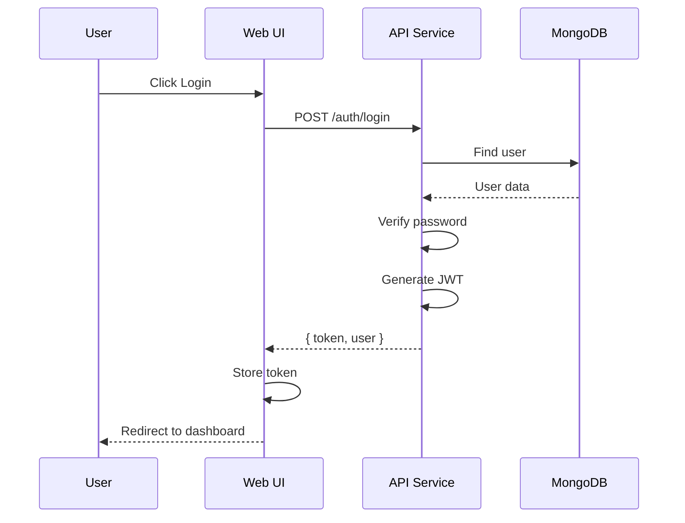
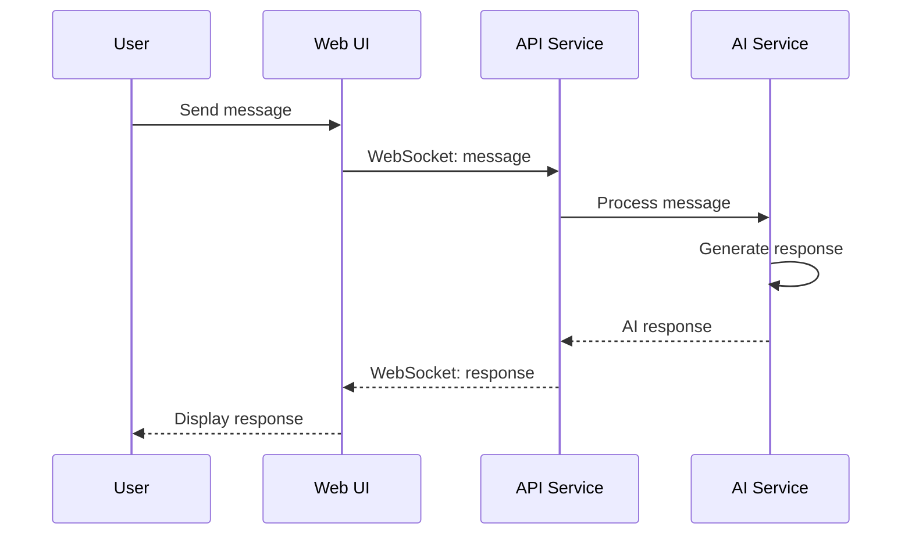
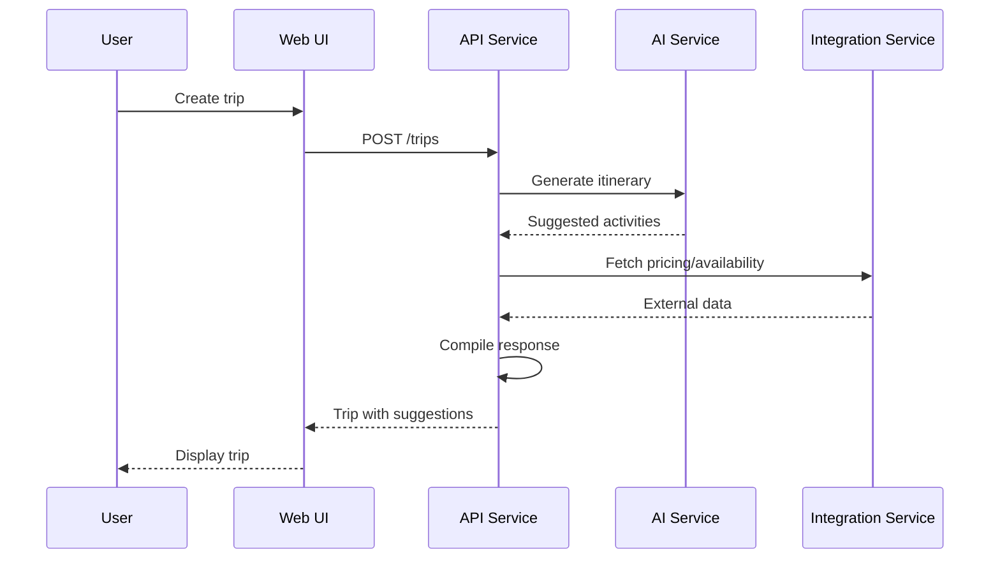

# Sequence Diagrams

## User Authentication Flow

```mermaid
sequenceDiagram
    participant U as User
    participant W as Web UI
    participant A as API Service
    participant DB as MongoDB

    U->>W: Click Login
    W->>A: POST /auth/login
    A->>DB: Find user
    DB-->>A: User data
    A->>A: Verify password
    A->>A: Generate JWT
    A-->>W: { token, user }
    W->>W: Store token
    W-->>U: Redirect to dashboard
```

## Chat Message Flow

```mermaid
sequenceDiagram
    participant U as User
    participant W as Web UI
    participant A as API Service
    participant AI as AI Service

    U->>W: Send message
    W->>A: WebSocket: message
    A->>AI: Process message
    AI->>AI: Generate response
    AI-->>A: AI response
    A-->>W: WebSocket: response
    W-->>U: Display response
```

## Trip Planning Flow

```mermaid
sequenceDiagram
    participant U as User
    participant W as Web UI
    participant A as API Service
    participant AI as AI Service
    participant I as Integration Service

    U->>W: Create trip
    W->>A: POST /trips
    A->>AI: Generate itinerary
    AI-->>A: Suggested activities
    A->>I: Fetch pricing/availability
    I-->>A: External data
    A->>A: Compile response
    A-->>W: Trip with suggestions
    W-->>U: Display trip
```
