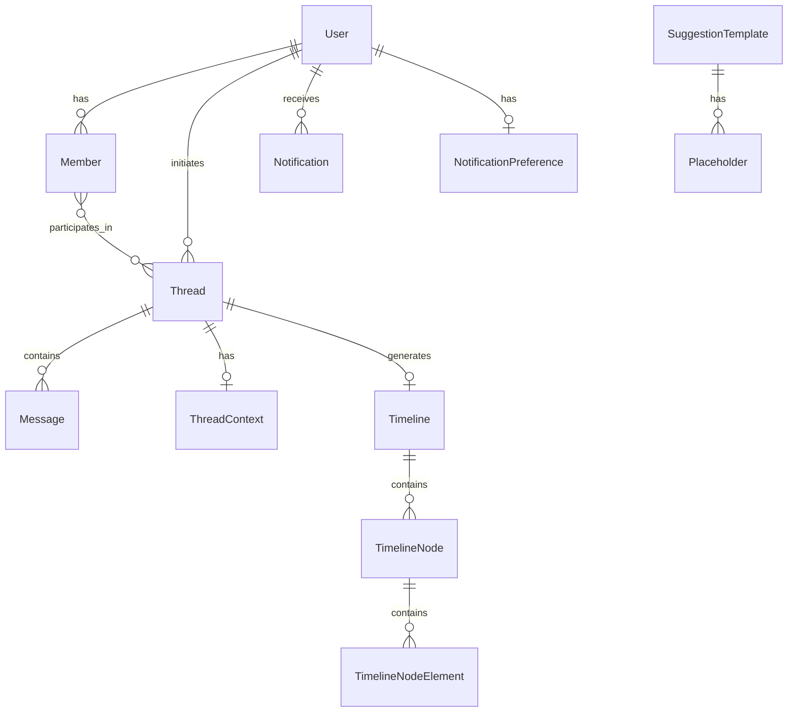

# TripMind Database Schema Documentation

> **Document Version:** 2.0  
> **Created:** 2026-01-24  
> **Last Updated:** 2026-01-24  
> **Status:** Draft - Pending Review

## 1. Overview

This document defines the database schema for the TripMind travel planning application. The schema is designed to support:

- **User Authentication & Authorization** (local, Google, Facebook)
- **Multi-Member Accounts** with detailed traveler profiles
- **AI-Powered Chat Conversations** via threads
- **Travel Timeline Planning** with versioning support
- **Real-time Timeline** with WebSocket-driven updates
- **Notifications** and alerts system
- **Suggestion Templates** for conversation starters

---

## 2. Entity Relationship Diagram



---

## 3. Core Tables

### 3.1 Users

Stores user account information and authentication details.

> [!NOTE]
> Email is used as the primary key for simplified lookups. If email changes are needed in the future, consider re-evaluating this design.

| Column | Type | Constraints | Description |
|--------|------|-------------|-------------|
| `email` | VARCHAR(255) | PRIMARY KEY | User email address (unique identifier) |
| `name` | VARCHAR(255) | NOT NULL | Display name |
| `password_hash` | VARCHAR(255) | NULLABLE | Hashed password (null for OAuth users) |
| `auth_provider` | ENUM | NOT NULL | `'local'`, `'google'`, `'facebook'` |
| `auth_provider_id` | VARCHAR(255) | NULLABLE | External provider user ID |
| `role` | ENUM | NOT NULL, DEFAULT 'user' | `'user'`, `'admin'` |
| `status` | ENUM | NOT NULL, DEFAULT 'active' | `'active'`, `'blocked'`, `'deleted'`, `'expired'`, `'pending_verification'` |
| `email_verified` | BOOLEAN | DEFAULT FALSE | Email verification status |
| `phone_number` | VARCHAR(20) | NULLABLE | User phone number |
| `phone_number_verified` | BOOLEAN | DEFAULT FALSE | Phone verification status |
| `created_at` | TIMESTAMP | NOT NULL, DEFAULT NOW() | Account creation time |
| `updated_at` | TIMESTAMP | NOT NULL, DEFAULT NOW() | Last update time |

**Indexes:**
- `idx_users_auth_provider` on `(auth_provider, auth_provider_id)`
- `idx_users_status` on `status`
- `idx_users_phone` on `phone_number`

---

### 3.2 Members

Stores details of all members within a user's account (family members, travel companions, etc.).

| Column | Type | Constraints | Description |
|--------|------|-------------|-------------|
| `id` | UUID | PRIMARY KEY | Unique member identifier |
| `user_email` | VARCHAR(255) | FOREIGN KEY → Users, NOT NULL | Parent user account |
| `avatar` | VARCHAR(500) | NULLABLE | Profile picture URL |
| `name` | VARCHAR(255) | NOT NULL | Full name of member |
| `is_primary_member` | BOOLEAN | DEFAULT FALSE | Is the primary account holder |
| `dob` | DATE | NULLABLE | Date of birth |
| `relation` | VARCHAR(100) | NULLABLE | Relationship with primary member (e.g., 'spouse', 'child', 'parent', 'friend') |
| `interest_profile` | JSONB | NULLABLE | Travel interests, food preferences, hobbies |
| `location_details` | JSONB | NULLABLE | Primary, office, and other locations |
| `travel_profile` | JSONB | NULLABLE | Visa, passport, and travel document details |
| `travel_instructions` | JSONB | NULLABLE | Special travel instructions and requirements |
| `created_at` | TIMESTAMP | NOT NULL, DEFAULT NOW() | Creation time |
| `updated_at` | TIMESTAMP | NOT NULL, DEFAULT NOW() | Last update time |

**JSONB Structure: `interest_profile`**
```json
{
  "travel_interest": ["beach", "mountains", "cultural"],
  "food_interest": ["vegetarian", "local_cuisine"],
  "activity_preferences": ["hiking", "photography", "museums"]
}
```

**JSONB Structure: `location_details`**
```json
{
  "primary_location": {
    "coordinates": { "lat": 12.9716, "lng": 77.5946 },
    "location_name": "Bangalore, India",
    "address": "..."
  },
  "office_location": {
    "coordinates": { "lat": 12.9352, "lng": 77.6245 },
    "location_name": "HSR Layout"
  },
  "other_locations": []
}
```

**JSONB Structure: `travel_profile`**
```json
{
  "passport": {
    "available": true,
    "country": "India",
    "expiry_date": "2030-05-15"
  },
  "visas": [
    {
      "country": "USA",
      "type": "B1/B2",
      "expiry_date": "2028-03-20",
      "status": "valid"
    }
  ]
}
```

**JSONB Structure: `travel_instructions`**
```json
{
  "food_restrictions": ["no_pork", "gluten_free"],
  "medical_conditions": ["diabetes"],
  "accessibility_needs": ["wheelchair_friendly"],
  "preferences": ["window_seat", "aisle_preference_for_long_flights"],
  "special_requirements": ["frequent_toilet_breaks", "walking_difficulty"]
}
```

**Indexes:**
- `idx_members_user_email` on `user_email`
- `idx_members_is_primary` on `(user_email, is_primary_member)`

---

### 3.3 Threads

Represents a conversation/planning session. Used for both chat messages and travel timeline creation.

> [!NOTE]
> Renamed from "Chat Threads" to "Threads" as it serves both messaging and timeline purposes.

| Column | Type | Constraints | Description |
|--------|------|-------------|-------------|
| `id` | UUID | PRIMARY KEY | Thread identifier |
| `user_email` | VARCHAR(255) | FOREIGN KEY → Users, NULLABLE | Owner user (null for anonymous) |
| `timeline_id` | UUID | FOREIGN KEY → Timelines, NULLABLE | Active timeline for this thread |
| `timeline_ready_progress` | INTEGER | DEFAULT 0 | Progress (0-100+); above threshold triggers timeline creation |
| `status` | ENUM | NOT NULL, DEFAULT 'draft' | `'draft'`, `'planning'`, `'confirmed'`, `'completed'`, `'cancelled'`, `'dropped'` |
| `sub_status` | ENUM | NULLABLE | `'understanding'`, `'timeline_preparation'`, `'timeline_finalized'` |
| `summary` | VARCHAR(500) | NULLABLE | Single sentence summary of the travel |
| `version_details` | JSONB | NULLABLE | Stores version IDs and corresponding timeline IDs |
| `is_confirmed` | BOOLEAN | DEFAULT FALSE | Final confirmation status |
| `view` | VARCHAR(50) | DEFAULT 'init-chat' | Current view state |
| `created_at` | TIMESTAMP | NOT NULL, DEFAULT NOW() | Thread creation time |
| `updated_at` | TIMESTAMP | NOT NULL, DEFAULT NOW() | Last activity time |

**JSONB Structure: `version_details`**
```json
{
  "versions": [
    { "version_id": "v1", "timeline_id": "uuid-1", "status": "archived" },
    { "version_id": "v2", "timeline_id": "uuid-2", "status": "active" }
  ],
  "current_version": "v2"
}
```

**Indexes:**
- `idx_threads_user_email` on `user_email`
- `idx_threads_status` on `status`
- `idx_threads_timeline_id` on `timeline_id`

---

### 3.4 Thread Context

Stores the complete context collected for timeline creation. Populated once the system has gathered sufficient details.

| Column | Type | Constraints | Description |
|--------|------|-------------|-------------|
| `id` | UUID | PRIMARY KEY | Context identifier |
| `thread_id` | UUID | FOREIGN KEY → Threads, UNIQUE, NOT NULL | One context per thread |
| `budget` | DECIMAL(12,2) | NULLABLE | Estimated budget |
| `currency` | VARCHAR(3) | DEFAULT 'USD' | Currency code (ISO 4217) |
| `start_date` | DATE | NULLABLE | Trip start date |
| `end_date` | DATE | NULLABLE | Trip end date |
| `plan_summary` | TEXT | NULLABLE | Summary of the travel plan |
| `travellers_details` | JSONB | NULLABLE | Array of travellers with member references and context |
| `journey_context` | TEXT | NULLABLE | Overall journey context/narrative |
| `general_instructions` | JSONB | NULLABLE | Array of general instructions (string array) |
| `user_actions` | JSONB | NULLABLE | Action notes to be taken from user perspective |
| `created_at` | TIMESTAMP | NOT NULL, DEFAULT NOW() | Creation time |
| `updated_at` | TIMESTAMP | NOT NULL, DEFAULT NOW() | Last update time |

**JSONB Structure: `travellers_details`**
```json
[
  {
    "member_id": "uuid-member-1",
    "name": "John Doe",
    "travel_history_context": "Frequent traveler, prefers business class",
    "special_notes": "Requires vegetarian meals"
  }
]
```

**JSONB Structure: `general_instructions`**
```json
["Book hotels near city center", "Prefer morning flights", "Include local experiences"]
```

**JSONB Structure: `user_actions`**
```json
["Confirm passport validity", "Apply for Schengen visa", "Book travel insurance"]
```

**Indexes:**
- `idx_thread_context_thread_id` on `thread_id`

---

### 3.5 Messages

Stores individual messages in a thread.

| Column | Type | Constraints | Description |
|--------|------|-------------|-------------|
| `id` | UUID | PRIMARY KEY | Message identifier |
| `thread_id` | UUID | FOREIGN KEY → Threads, NOT NULL | Parent thread |
| `sender_id` | VARCHAR(255) | NOT NULL | User email or 'ai_system' |
| `role` | ENUM | NOT NULL | `'user'`, `'assistant'` |
| `type` | ENUM | NOT NULL | `'text'`, `'markdown'`, `'image'`, `'card'`, `'json'`, `'error'` |
| `content` | BYTEA | NOT NULL | Message content (supports JSON, markdown, text, or binary) |
| `status` | ENUM | NOT NULL, DEFAULT 'sent' | `'sent'`, `'delivered'`, `'read'`, `'failed'` |
| `metadata` | JSONB | NULLABLE | Additional message data |
| `created_at` | TIMESTAMP | NOT NULL, DEFAULT NOW() | Message timestamp |

**Indexes:**
- `idx_messages_thread_id` on `thread_id`
- `idx_messages_created_at` on `(thread_id, created_at)`

---

## 4. Timeline Tables

### 4.1 Timeline

Main timeline container for travel plans.

| Column | Type | Constraints | Description |
|--------|------|-------------|-------------|
| `id` | UUID | PRIMARY KEY | Timeline identifier |
| `thread_id` | UUID | FOREIGN KEY → Threads, NOT NULL | Source thread |
| `rendering_style` | VARCHAR(50) | DEFAULT 'default' | AI processing/display style |
| `start_date` | DATE | NULLABLE | Trip start date |
| `end_date` | DATE | NULLABLE | Trip end date |
| `budget` | DECIMAL(12,2) | DEFAULT 0 | Estimated budget |
| `budget_type` | ENUM | DEFAULT 'approx' | `'confirmed'`, `'approx'` |
| `adults_count` | INTEGER | DEFAULT 1 | Number of adults |
| `children_count` | INTEGER | DEFAULT 0 | Number of children |
| `timeline_context` | TEXT | NULLABLE | Markdown data with full context |
| `status` | ENUM | NOT NULL, DEFAULT 'draft' | `'draft'`, `'in_progress'`, `'ready'`, `'confirmed'`, `'archived'` |
| `created_at` | TIMESTAMP | NOT NULL, DEFAULT NOW() | Creation time |
| `updated_at` | TIMESTAMP | NOT NULL, DEFAULT NOW() | Last modification time |

**Indexes:**
- `idx_timeline_thread_id` on `thread_id`
- `idx_timeline_status` on `status`

---

### 4.2 Timeline Nodes

Individual nodes in the timeline (polymorphic structure).

| Column | Type | Constraints | Description |
|--------|------|-------------|-------------|
| `id` | UUID | PRIMARY KEY | Node identifier |
| `timeline_id` | UUID | FOREIGN KEY → Timelines, NOT NULL | Parent timeline |
| `node_version` | INTEGER | NOT NULL, DEFAULT 1 | Node version for updates |
| `status` | ENUM | NOT NULL, DEFAULT 'active' | `'active'`, `'inactive'`, `'in_progress'` |
| `order` | INTEGER | NOT NULL | Display order (0 = start) |
| `type` | ENUM | NOT NULL | `'start'`, `'end'`, `'task_node'`, `'representation_node'`, `'action'`, `'representation'`, `'additional_input'` |
| `subtype` | VARCHAR(50) | NULLABLE | `'default'`, `'tasks_only'`, `'recommendation_only'`, `'weather'`, `'alert'`, `'location'` |
| `display_title` | VARCHAR(255) | NULLABLE | Node title for display |
| `display_subtitle` | VARCHAR(255) | NULLABLE | Node subtitle |
| `display_icon` | JSONB | NULLABLE | Icon provider and name |
| `node_summary` | JSONB | NULLABLE | Summary of node and elements for LLM fine-tuning |
| `tasks_status` | ENUM | NULLABLE | `'pending'`, `'in_progress'`, `'completed'` |
| `recommendation_status` | ENUM | NULLABLE | `'pending'`, `'reviewed'`, `'accepted'` |
| `display_date_type` | ENUM | NULLABLE | `'date'`, `'date_range'`, `'time'`, `'time_range'` |
| `display_date_label` | VARCHAR(100) | NULLABLE | Formatted date label |
| `display_date_start` | TIMESTAMP | NULLABLE | Start datetime |
| `display_date_end` | TIMESTAMP | NULLABLE | End datetime (for ranges) |
| `created_at` | TIMESTAMP | NOT NULL, DEFAULT NOW() | Creation time |
| `updated_at` | TIMESTAMP | NOT NULL, DEFAULT NOW() | Last update time |

**JSONB Structure: `display_icon`**
```json
{
  "provider": "iconify",
  "name": "mdi:airplane-takeoff"
}
```

**JSONB Structure: `node_summary`**
```json
{
  "summary": "Flight booking from Bangalore to Paris",
  "elements_summary": ["Direct flight", "Business class", "Morning departure"],
  "keywords": ["flight", "paris", "travel"]
}
```

**Indexes:**
- `idx_timeline_nodes_timeline_id` on `timeline_id`
- `idx_timeline_nodes_order` on `(timeline_id, order)`
- `idx_timeline_nodes_type` on `type`
- `idx_timeline_nodes_status` on `status`

---

### 4.3 Timeline Node Elements

Unified table for tasks and recommendations within nodes.

| Column | Type | Constraints | Description |
|--------|------|-------------|-------------|
| `id` | UUID | PRIMARY KEY | Element identifier |
| `timeline_node_id` | UUID | FOREIGN KEY → TimelineNodes, NOT NULL | Parent node |
| `timeline_id` | UUID | FOREIGN KEY → Timelines, NOT NULL | Parent timeline (for easier queries) |
| `element_type` | ENUM | NOT NULL | `'task'`, `'recommendation'` |
| `element_category` | VARCHAR(100) | NOT NULL | Category (e.g., 'flight_booking', 'hotel_reservation', 'visa_enquiry', 'purchase_item') |
| `element_icon` | JSONB | NULLABLE | Icon provider and name |
| `title` | VARCHAR(255) | NOT NULL | Element title |
| `description` | TEXT | NULLABLE | Element description |
| `price_range` | JSONB | NULLABLE | Price details with min, max, confirmed values |
| `status` | ENUM | NOT NULL, DEFAULT 'pending' | `'confirmed'`, `'pending'`, `'completed'`, `'cancelled'` |
| `priority` | INTEGER | DEFAULT 1 | Display/execution priority |
| `order` | INTEGER | DEFAULT 0 | Display order within node |
| `metadata` | JSONB | NULLABLE | Additional element-specific data |
| `created_at` | TIMESTAMP | NOT NULL, DEFAULT NOW() | Creation time |
| `updated_at` | TIMESTAMP | NOT NULL, DEFAULT NOW() | Last update time |

**JSONB Structure: `element_icon`**
```json
{
  "provider": "iconify",
  "name": "mdi:airplane"
}
```

**JSONB Structure: `price_range`**
```json
{
  "type": "range",
  "currency": "USD",
  "min": 500,
  "max": 800,
  "confirmed": null
}
```

**Indexes:**
- `idx_timeline_node_elements_node_id` on `timeline_node_id`
- `idx_timeline_node_elements_timeline_id` on `timeline_id`
- `idx_timeline_node_elements_type` on `element_type`
- `idx_timeline_node_elements_status` on `status`

---

## 5. Notification System

### 5.1 Notifications

General user notifications.

| Column | Type | Constraints | Description |
|--------|------|-------------|-------------|
| `id` | UUID | PRIMARY KEY | Notification identifier |
| `thread_id` | UUID | FOREIGN KEY → Threads, NULLABLE | Related thread |
| `timeline_id` | UUID | FOREIGN KEY → Timelines, NULLABLE | Related timeline |
| `version` | INTEGER | NULLABLE | Timeline version reference |
| `title` | VARCHAR(255) | NOT NULL | Notification title |
| `message` | TEXT | NOT NULL | Full message |
| `priority` | ENUM | NOT NULL, DEFAULT 'medium' | `'low'`, `'medium'`, `'high'`, `'urgent'` |
| `type` | ENUM | NOT NULL | `'flight_delay'`, `'flight_change'`, `'weather_alert'`, `'booking_confirmation'`, `'reminder'`, `'travel_update'`, `'system'` |
| `action_url` | VARCHAR(500) | NULLABLE | Deep link URL |
| `is_read` | BOOLEAN | DEFAULT FALSE | Read status |
| `metadata` | JSONB | NULLABLE | Additional data |
| `created_at` | TIMESTAMP | NOT NULL, DEFAULT NOW() | Creation time |

**Indexes:**
- `idx_notifications_thread_id` on `thread_id`
- `idx_notifications_timeline_id` on `timeline_id`
- `idx_notifications_read` on `is_read`
- `idx_notifications_created_at` on `created_at DESC`

---

### 5.2 Notification Preferences

User notification settings.

| Column | Type | Constraints | Description |
|--------|------|-------------|-------------|
| `id` | UUID | PRIMARY KEY | Preference identifier |
| `user_email` | VARCHAR(255) | FOREIGN KEY → Users, NOT NULL, UNIQUE | User reference |
| `email_notifications` | BOOLEAN | DEFAULT TRUE | Email enabled |
| `push_notifications` | BOOLEAN | DEFAULT TRUE | Push enabled |
| `flight_updates` | BOOLEAN | DEFAULT TRUE | Flight alerts |
| `weather_alerts` | BOOLEAN | DEFAULT TRUE | Weather alerts |
| `booking_reminders` | BOOLEAN | DEFAULT TRUE | Booking reminders |
| `updated_at` | TIMESTAMP | NOT NULL, DEFAULT NOW() | Last update |

**Indexes:**
- `idx_notification_preferences_user_email` on `user_email`

---

## 6. Content Templates

### 6.1 Suggestion Templates

Predefined conversation starters for home page.

| Column | Type | Constraints | Description |
|--------|------|-------------|-------------|
| `id` | UUID | PRIMARY KEY | Template identifier |
| `priority` | INTEGER | NOT NULL | Display priority (lower = higher priority) |
| `template_text` | TEXT | NOT NULL | Template with placeholders (supports Markdown) |
| `description` | VARCHAR(255) | NULLABLE | Template description |
| `display_type` | ENUM | DEFAULT 'all' | `'mobile'`, `'desktop'`, `'all'` |
| `category` | ENUM | NOT NULL | `'long_time_plan'`, `'short_time_plan'`, `'weekend_plan'`, `'quick_trip'` |
| `locality_point` | GEOGRAPHY(POINT, 4326) | NULLABLE | Geolocation point for locality-based suggestions |
| `locality_radius_km` | INTEGER | DEFAULT 50 | Search radius in kilometers |
| `placeholder_options` | JSONB | NULLABLE | Placeholder keys and their options |
| `is_active` | BOOLEAN | DEFAULT TRUE | Active status |
| `created_at` | TIMESTAMP | NOT NULL, DEFAULT NOW() | Creation time |
| `updated_at` | TIMESTAMP | NOT NULL, DEFAULT NOW() | Last update |

**JSONB Structure: `placeholder_options`**
```json
{
  "destination": {
    "type": "select",
    "options": ["Paris", "London", "Tokyo", "New York"]
  },
  "duration": {
    "type": "select",
    "options": ["3 days", "1 week", "2 weeks"]
  },
  "trip_type": {
    "type": "select",
    "options": ["Solo", "Family", "Couple", "Friends"]
  }
}
```

> [!NOTE]
> The `locality_point` column uses PostGIS GEOGRAPHY type for efficient geospatial queries. This allows finding relevant suggestions based on user's location using queries like:
> ```sql
> SELECT * FROM suggestion_templates 
> WHERE ST_DWithin(locality_point, ST_MakePoint(lng, lat)::geography, locality_radius_km * 1000);
> ```

**Indexes:**
- `idx_suggestion_templates_priority` on `priority`
- `idx_suggestion_templates_active` on `is_active`
- `idx_suggestion_templates_category` on `category`
- `idx_suggestion_templates_locality` GIST on `locality_point`

---

## 7. Session Management

### 7.1 Refresh Tokens

Stores refresh tokens for JWT authentication.

| Column | Type | Constraints | Description |
|--------|------|-------------|-------------|
| `id` | UUID | PRIMARY KEY | Token identifier |
| `user_email` | VARCHAR(255) | FOREIGN KEY → Users, NOT NULL | Token owner |
| `token_hash` | VARCHAR(255) | NOT NULL, UNIQUE | Hashed refresh token |
| `device_info` | VARCHAR(255) | NULLABLE | Device identification |
| `ip_address` | VARCHAR(45) | NULLABLE | Client IP address |
| `expires_at` | TIMESTAMP | NOT NULL | Token expiration |
| `revoked_at` | TIMESTAMP | NULLABLE | Revocation timestamp |
| `created_at` | TIMESTAMP | NOT NULL, DEFAULT NOW() | Creation time |

**Indexes:**
- `idx_refresh_tokens_user_email` on `user_email`
- `idx_refresh_tokens_hash` on `token_hash`
- `idx_refresh_tokens_expires` on `expires_at`

---

## 8. Enumerations Summary

### 8.1 All ENUM Types

```sql
-- Authentication & User
CREATE TYPE auth_provider AS ENUM ('local', 'google', 'facebook');
CREATE TYPE user_role AS ENUM ('user', 'admin');
CREATE TYPE user_status AS ENUM ('active', 'blocked', 'deleted', 'expired', 'pending_verification');

-- Thread
CREATE TYPE thread_status AS ENUM ('draft', 'planning', 'confirmed', 'completed', 'cancelled', 'dropped');
CREATE TYPE thread_sub_status AS ENUM ('understanding', 'timeline_preparation', 'timeline_finalized');

-- Messages
CREATE TYPE message_role AS ENUM ('user', 'assistant');
CREATE TYPE message_type AS ENUM ('text', 'markdown', 'image', 'card', 'json', 'error');
CREATE TYPE message_status AS ENUM ('sent', 'delivered', 'read', 'failed');

-- Timeline
CREATE TYPE timeline_status AS ENUM ('draft', 'in_progress', 'ready', 'confirmed', 'archived');
CREATE TYPE budget_type AS ENUM ('confirmed', 'approx');
CREATE TYPE node_type AS ENUM ('start', 'end', 'task_node', 'representation_node', 'action', 'representation', 'additional_input');
CREATE TYPE node_status AS ENUM ('active', 'inactive', 'in_progress');
CREATE TYPE display_date_type AS ENUM ('date', 'date_range', 'time', 'time_range');
CREATE TYPE tasks_status AS ENUM ('pending', 'in_progress', 'completed');
CREATE TYPE recommendation_status AS ENUM ('pending', 'reviewed', 'accepted');

-- Timeline Node Elements
CREATE TYPE element_type AS ENUM ('task', 'recommendation');
CREATE TYPE element_status AS ENUM ('confirmed', 'pending', 'completed', 'cancelled');

-- Notifications
CREATE TYPE notification_type AS ENUM ('flight_delay', 'flight_change', 'weather_alert', 'booking_confirmation', 'reminder', 'travel_update', 'system');
CREATE TYPE notification_priority AS ENUM ('low', 'medium', 'high', 'urgent');

-- Suggestion Templates
CREATE TYPE display_type AS ENUM ('mobile', 'desktop', 'all');
CREATE TYPE suggestion_category AS ENUM ('long_time_plan', 'short_time_plan', 'weekend_plan', 'quick_trip');
```

---

## 9. Recommended Database

### PostgreSQL with Extensions

| Extension | Purpose |
|-----------|---------|
| `uuid-ossp` | UUID generation |
| `pgcrypto` | Password hashing |
| `pg_trgm` | Full-text search |
| `postgis` | Geospatial queries for locality-based suggestions |

### Why PostgreSQL?

1. **JSONB Support** - Flexible metadata storage for profiles and configurations
2. **PostGIS** - Efficient geolocation queries for suggestion templates
3. **ENUM Types** - Type-safe status fields
4. **Real-time** - Compatible with Supabase for real-time features
5. **Full-Text Search** - Built-in search capabilities
6. **BYTEA** - Binary storage for flexible message content

---

## 10. Migration Considerations

### From In-Memory to PostgreSQL

The current implementation uses in-memory Maps for:
- `threadProgress`
- `threadMessages`
- `threadSuggestions`
- `timelineNotifications`
- `timelineVersions`
- Dummy travel/user arrays

**Migration Steps:**
1. Set up PostgreSQL with PostGIS extension
2. Create database migration files
3. Update services to use ORM (Prisma/TypeORM/Drizzle recommended)
4. Add connection pooling (PgBouncer)
5. Implement data seeding for development

---

## 11. API Flow → Database Mapping

| API Endpoint | Primary Table(s) |
|--------------|------------------|
| `POST /api/v1/chat/new` | Threads, Messages |
| `GET /api/v1/chat/:userEmail/:threadId/messages` | Messages |
| `POST /api/v1/chat/:userEmail/:threadId/stream` | Messages |
| `GET /api/v1/threads/:threadId/context` | ThreadContext |
| `GET /api/v1/timelines/:threadId` | Timeline, TimelineNodes, TimelineNodeElements |
| `GET /api/v1/members` | Members |
| `POST /api/v1/auth/login` | Users, RefreshTokens |
| `POST /api/v1/auth/register` | Users, Members |
| `GET /api/v1/suggestions/templates` | SuggestionTemplates |
| WebSocket `/timeline` | Timeline, TimelineNodes, TimelineNodeElements |

---

## 12. Tables Removed/Consolidated

The following tables from v1.0 have been removed or consolidated:

| Removed Table | Reason |
|---------------|--------|
| `Travels` | Consolidated into Threads - threads now manage the full travel lifecycle |
| `TravelImages` | Can be stored as part of thread/timeline metadata |
| `ChatSuggestions` | Inline in message metadata |
| `Tasks` | Consolidated into `TimelineNodeElements` |
| `Recommendations` | Consolidated into `TimelineNodeElements` |
| `Representations` | Stored as node subtype with display fields |
| `AdditionalInputs` | Stored as node subtype with display fields |
| `AdditionalInputOptions` | Stored in node metadata |
| `TimelineVersions` | Moved to `version_details` JSONB in Threads |
| `TimelineNotifications` | Consolidated into `Notifications` |
| `TemplatePlaceholders` | Moved to `placeholder_options` JSONB |
| `PlaceholderOptions` | Moved to `placeholder_options` JSONB |

---

## 13. Next Steps

1. **Review & Approve** this schema design
2. **Enable PostGIS** extension for geospatial features
3. **Choose ORM** (Prisma recommended for TypeScript)
4. **Create migration files** with version control
5. **Implement connection pool** and database client
6. **Update services** to use database instead of in-memory
7. **Add seed data** for development/testing
8. **Set up database backups** and monitoring

---

> [!IMPORTANT]
> This schema is designed for PostgreSQL with PostGIS. If using a different database (MongoDB, MySQL), adjustments will be needed for:
> - ENUM types (use strings with validation)
> - JSONB columns (JSON or separate tables)
> - GEOGRAPHY columns (alternative geospatial solution)
> - BYTEA columns (BLOB or TEXT depending on use case)
